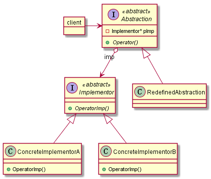

# Bridge/Handle-Body

## 动机（Motivation）

由于某些类型的固有的实现逻辑，使得它们具有两个变化的维度，乃至多个纬度的变化。

如何应对这种“多维度的变化”？如何利用面向对象技术来使得类型可以轻松地沿着两个乃至多个方向变化，而不引入额外的复杂度？

## 模式定义

将抽象部分(业务功能)与实现部分(平台实现)分离，使它们都可以独立地变化。
——《设计模式》GoF 

## 结构

### 基本结构

参与者与责任：

+   Abstraction：
    +   定义抽象类接口(逻辑层面的抽象接口)
    +   维护一个指向 Implementor 对象的指针

+   Implementor：
    +   定义实现类的接口(主要是关于低于逻辑，的实现方面的接口)。 接口与 Abstraction 
        可以完全不同。  一般来讲，Implementor 仅提供基本操作，Abstraction 定义基于这
        些基本操作的较高层次的操作。

+   RefinedAbstraction： 扩充 Abstraction 的接口

+   ConcreteImplement： 实现 Implementor 接口，并定义其具体实现。

### 实现细节

实现桥接模式需要注意的问题：

+   在仅有一个具体实现的时候，不用单独创建一个单独的 Implemetor 类。

+   共享 Implementor 对象。 在 C++ 中使用引用计数/智能指针共享，但是要注意循环引用。

+   多重继承将抽象与实现绑定在一起，无法实现桥接模式。

## 效果

优点如下：

+   分离抽象与实现。可以是抽象与实现独立变化，符合单一职责原则。

+   桥接模式提高了系统的可扩充性，在两个变化维度中任意扩展一个维度，都不需要修改原有系统。

+   实现细节对客户透明，可以对用户隐藏实现细节。

缺点如下：

+   

## 要点总结

+ Bridge模式使用“对象间的组合关系”解耦了抽象和实现之间固有的绑定关系，使得抽象和实现可以沿着各自的维度来变化。所谓抽象和实现沿着各自纬度的变化，即“子类化”它们。

+ Bridge模式有时候类似于多继承方案，但是多继承方案往往违背单一职责原则（即一个类只有一个变化的原因），复用性比较差。Bridge模式是比多继承方案更好的解决方法。

+ Bridge模式的应用一般在“两个非常强的变化维度”，有时一个类也有多于两个的变化维度，这时可以使用Bridge的扩展模式。

+ Bridge 模式在于将具体实现层次与逻辑层次做分离，使逻辑层含有实现层次的基类指针以便供逻辑层调用。同时逻辑层可以在逻辑操作上变化从而继承基类成为不同子类。 主要体现了逻辑与实现两个层次的桥接。