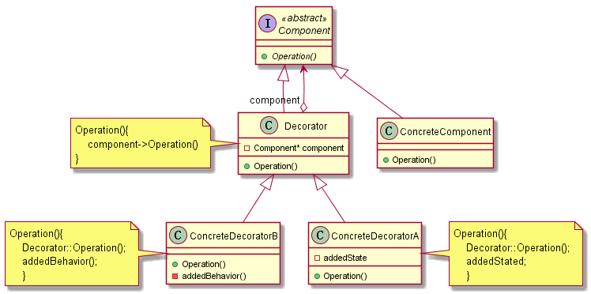

# Decorator/Wapper

## 动机（Motivation）

在某些情况下我们可能会“过度地使用继承来扩展对象的功能”，由于继承为类型引入的静态特质，使得这种扩展方式缺乏灵活性；
并且随着子类的增多（扩展功能的增多），各种子类的组合（扩展功能的组合）会导致更多子类的膨胀。

如何使“对象功能的扩展”能够根据需要来动态地实现？同时避免“扩展功能的增多”带来的子类膨胀问题？从而使得任何“功能扩展变化”所导致的影响将为最低？

## 模式定义

动态（组合）地给一个对象增加一些额外的职责。就增加功能而言，Decorator模式比生成子类（继承）更为灵活（消除重复代码 & 减少子类个数）。
——《设计模式》GoF

## 结构

### 基本结构

参与者及职责：

+   Component：定义一个对象接口，可以给这些对象动态添加职责。抽象类。

+   ConcreteComponent：定义一个对象可以给这个对象添加一些职责。 Component 的 子类。

+   Decorator：维持一个指向 Component 对象的指针，并定义一个与 Component 接口一直的
    接口。

    > 继承自 Component 类，拥有其相同接口。
    >
    > 维护一个 Component 指针，根据构造时传入具体的 ConcreteComponent 动态调用其操作。

+   ConcreteDecorator：向组件添加职责。

    > 继承自 Decorator，自然的可以包裹 ConcreteComponent 指针，在调用原有操作的基础上可以增加『装饰』。

### 实现细节

+   接口的一致性：装饰对象的接口必须与其装饰的 Component 有相同的接口。

+   省略抽象的 Decorator 类：当只有一个装饰对象的时候，没有必要定义抽象的 Decorator 
    对象，这是可以将 Decorator 向 Component 妆发请求的职责合并到 ComcreteDecorator
    中。

+   保持 Component 的简单性。 Component集中于定义接口而不是储存数据。

+   当 Component 本身就很大时，使用 Decorator 代价太高，Strategy 相对更好一些。
    Decorator 改变外壳，Strategy 改变内核。

## 效果

优点如下：

+   Decorator 使用组合比静态继承(多重继承)更加灵活。 使用继承会是每增加一个新的职责就
    要增加一个新的子类，当有多个职责互相组合的时候，与多少组合就需要多少个子类，使系统
    类数目急剧膨胀，增加系统复杂度。 但是使用 Decorator 具体组合有用户指定更加灵活，
    减少复杂度的同时可以减少一些静态重复代码。

+   具体构件类与具体装饰类可以独立变化，用户可以根据需要增加新的具体构件类和具体装饰类，在使用时再对其进行组合，原有代码无须改变，符合“开闭原则”

缺点如下：

+   这种比继承更加灵活机动的特性，也同时意味着装饰模式比继承更加易于出错，排错也很困难，对于多次装饰的对象，调试时寻找错误可能需要逐级排查，较为烦琐。

+   使用装饰模式进行系统设计时将产生很多小对象，这些对象的区别在于它们之间相互连接的方式有所不同，而不是它们的类或者属性值有所不同，同时还将产生很多具体装饰类。这些装饰类和小对象的产生将增加系统的复杂度，加大学习与理解的难度

## 适用场合

+   在不影响其他对象的情况下，以动态、透明的方式给单个对象添加职责。

+   需要动态地给一个对象增加功能，这些功能也可以动态地被撤销。

+   当不能采用继承的方式对系统进行扩充或者采用继承不利于系统扩展和维护时。不能采用继承的情况主要有两类：第一类是系统中存在大量独立的扩展，为支持每一种组合将产生大量的子类，使得子类数目呈爆炸性增长；第二类是因为类定义不能继承（如final类）.

## 代码示例

[decorator3.cpp](./decorator3.cpp)

## 要点总结

通过采用组合而非继承的手法， Decorator模式实现了在运行时动态扩展对象功能的能力，而且可以根据需要扩展多个功能。
避免了使用继承带来的“灵活性差”和“多子类衍生问题”。

Decorator类在接口上表现为is-a Component的继承关系，即Decorator类继承了Component类所具有的接口。
但在实现上又表现为has-a Component的组合关系，即Decorator类又使用了另外一个Component类。

Decorator模式的目的并非解决“多子类衍生的多继承”问题，Decorator模式应用的要点在于解决“主体类在多个方向上的扩展功能”——是为“装饰”的含义。
