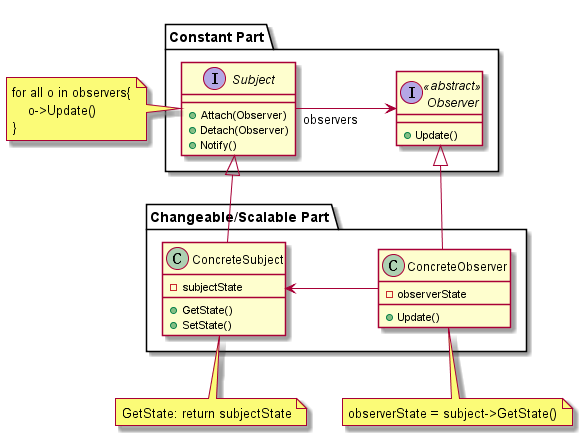

# Observer

## 动机（Motivation）

在软件构建过程中，我们需要为某些对象建立一种“通知依赖关系” ——一个对象（目标对象）的状态发生改变，所有的依赖对
象（观察者对象）都将得到通知。如果这样的依赖关系过于紧密，将使软件不能很好地抵御变化。

使用面向对象技术，可以将这种依赖关系弱化，并形成一种稳定的依赖关系。从而实现软件体系结构的松耦合。

## 模式定义

定义对象间的一种一对多（变化）的依赖关系，以便当一个对象(Subject)的状态发生改变时，所有依赖于它的对象都得到通知并自动更新。
——《 设计模式》 GoF

观察者模式又叫做发布-订阅（Publish/Subscribe）模式、模型-视图（Model/View）模式、源-监听器（Source/Listener）模式或从属者（Dependents）模式。

## 结构

参与者与责任：

+   Subject(目标)：
    +   目标可以知道他有多少观察者。使用数组存储与观察者对应的状态变量或者指针。
    +   提供注册和好删除观察者的接口。

+   Observer(观察者)：
    +   为目标发生改变时候需要获得通知的对象定义一个更新接口

+   ConcreteSubject(具体目标)：
    +   当其状态发生改变的时候，向他的观察者发出通知。
    +   将有关状态存入各个 ConcreteObserver 对象。

    > 即在这里进行更新 ConcreteObserver 状态，使用的是 Subject 保存的 
    > ConcreteObserver 指针

+   ConcreteObserver(具体观察者)：
    +   维护一个指向 ConreteSubject 对象的引用(指针)
    +   存储有关状态，这些状态应该与目标状态保存一致。
    +   实现 Observer 的更新接口以使自身状态与目标状态保存一致。

    > 虽然在 ConcreteObserver 中实现，但却在 ConcreteSubject 中调用。 

> 一个具体的目标可以对应多个观察者，观察者可以自己『订阅/取消订阅』
>
> UML 中使用私有变量来保存状态，也可以使用指针来指向同一快内存(共享变量)，但是对于内存
所有权(`new/delete`)因该属于观察者。

## 效果 

优点如下：

+   目标和抽象者的抽象(Observer)耦合。 一个目标知道其所有的观察者都符合 Observer 的接口。

+   支持广播通信。

+   符合『依赖倒置原则』 和 『开闭原则』

缺点如下：

+   如果有很多的直接或间接观察者，则依次通知所有的观察者会花费很多时间。

+   观察者与观察目标之间有循环依赖会导致循环调用，从而使系统崩溃。

+   观察者只知道目标发生了变化，但是不知道怎么发生的变化。

## 实现细节

设计模式 197页

## 相关模式

Mediator 模式：当目标与观察者之间有复杂的太依赖关系可以使用该模式来管理更新语义。

Singleton 模式： 用到 Mediator 模式的时候可以使用此模式来保证其全局唯一可访问。

## 要点总结

+ 使用面向对象的抽象，Observer模式使得我们可以独立地改变目标与观察者，从而使二者之间的依赖关系达致松耦合。
+ 目标发送通知时，无需指定观察者，通知（可以携带通知信息作为参数）会自动传播。
+ 观察者自己决定是否需要订阅通知，目标对象对此一无所知。
+ Observer模式是基于事件的UI框架中非常常用的设计模式，也是MVC模式的一个重要组成部分。
