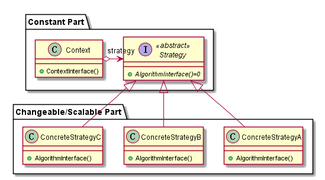
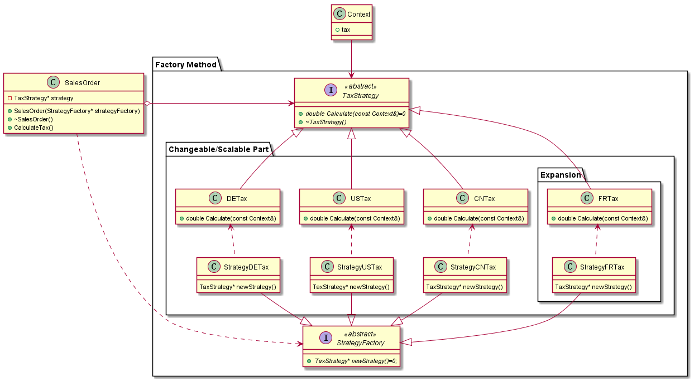
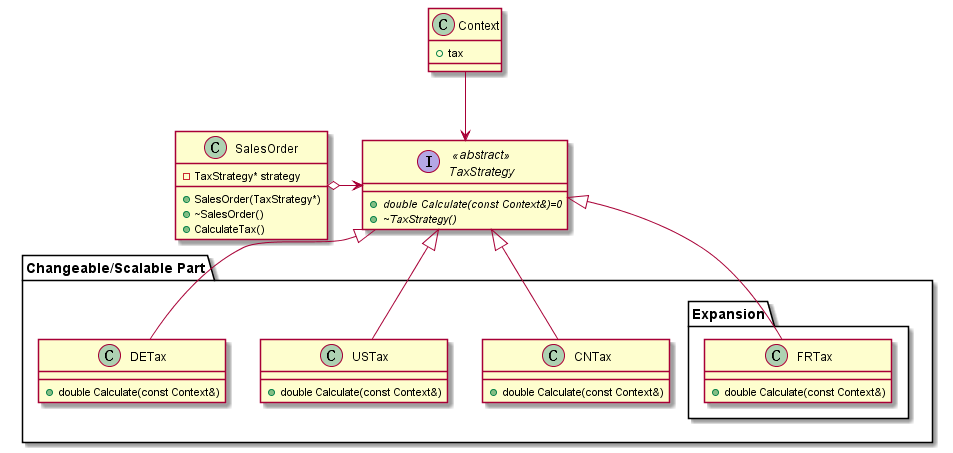

# Strategy

## 动机（Motivation）

+ 在软件构建过程中，某些对象使用的算法可能多种多样，经常改变，如果将这些算法都编码到对象中，将会使对象变得异常复杂；而且有时候支持不使用的算法也是一个性能负担。
+ 如何在运行时根据需要透明地更改对象的算法？将算法与对象本身解耦，从而避免上述问题？

## 模式定义

定义一系列算法，把它们一个个封装起来，并且使它们可互相替换（变化）。该模式使得算法可独立于使用它的客户程序(稳定)而变化（扩展，子类化）。
——《设计模式》 GoF

## 结构
    

## 适用场合

1. 许多相关的类目的相同仅仅是『行为/方式/算法』不同。 『策略』可以提供多种不同的行为中的一
种，进行配置来达到相同的目的。

2. 需要使用一个算法的不同变体。 这些变体可能在时间/空间上需要权衡。

3. 算法使用客户不应该知道的数据。 使用策略模式可以避免暴露与算法相关的数据结构。

4. 一个类存在多种『行为』，这些行为在类的操作中多以多个**条件语句**的形式出现，则可以将
相关的条件分支移到册子的 Strategy 类中代替条件语句。

## 效果

优点如下：

+   提供了一个替代使用继承关系来实现相同功能的方法。 如果使用继承关系则 Context 类中进
    行硬编码，即使为了防止硬编码的实现，提取一个 Context 的抽象类，变化为 Factory Method 但是已经不适用于这个场合了。

+   消除了一些条件语句。 当一个类中使用条件语句堆砌了不同行为时，可以将不同行为封装在不
    同的 Strategy 子类中。

+   提供实现的选择。 Strategy 模式可以提供相同行为的不同实现。

+   

缺点如下：

+   客户必须了解不同的策略，及其差别并作出选择。 因此不得不向客户暴露具体的实现，也正是
    这些不同行为的变体与客户相关时，才使用。

+    增加了对象数目，可以使用享元模式来减少对象数量。

+    Strategy 和 Context 之间的通信开销。(???)

## 代码示例

[策略模式示例代码2(Strategy + Factory Method)](./strategy2.cpp)

+   代码中 SalesOrder(对应于[上述 UML](./README.md##结构) 中的Context，后同) 类，
    聚合了 TaxStrategy(Strategy)，并且调用其接口计算税，使 SalesOrder(Context) 依赖于稳定的抽象类 TaxStrategy(Strategy)。

+   SalesOrder(Context) 中构造函数使用了 StrategyFactory 指针，使用工厂模式，使其
    依赖于工厂模式稳定部分从而保证了自己的稳定性，避免直接使用 TaxStrategy(Strategy)
    的具体类从而导致『硬编码』。

+   在扩展时候只需要扩展工厂模式部分即可。

[策略模式示例代码3(Strategy)](./strategy3.cpp)

+   这个例子中没有使用工厂方法，同样也没有用『硬编码』。

+   当实际情况复杂的时候可以考虑上述示例进一步调用其他模式。

    

## 要点总结

+ Strategy及其子类为组件提供了一系列可重用的算法，从而可以使得类型在运行时方便地根据需要在各个算法之间进行切换。

+ Strategy模式提供了用条件判断语句以外的另一种选择，消除条件判断语句，就是在解耦合。含有许多条件判断语句的代码通常都需要Strategy模式。

+ 如果Strategy对象没有实例变量，那么各个上下文可以共享同一个Strategy对象，从而节省对象开销。

