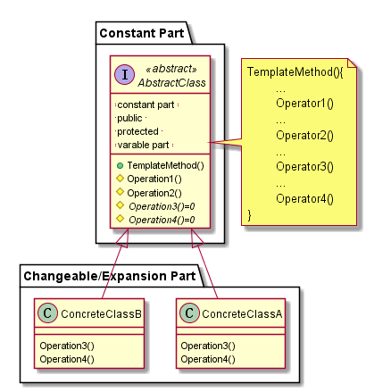

# Template Method

## 动机（Motivation）

在软件构建过程中，对于某一项任务，它常常有稳定的整体操作结构，但各个子步骤却有很多改变的需求，或者由于固有的原因（比如框架与应用之间的关系）而无法和任务的整体结构同时实现。

如何在确定**稳定操作结构**的前提下，来灵活应对各个**子步骤的变化**或者晚期实现需求？

## 模式定义

定义一个操作中的算法的骨架 **(稳定)** ，而将一些步骤延迟 **(变化)** 到子类中。
Template Method使得子类可以不改变(复用)一个算法的结构即可重定义(override 重写)该算法的某些特定步骤。
                                                         ——《 设计模式》 GoF

## 结构

## 适用情况

1. 实现一个算法的不变部分，将可变部分留给子类来实现。

2. 各个子类中公共的行为被提取出来并集中到一个公共父类中，以避免代码重复。

3. 控制子类扩展。

## 相关模式

[Factory Method 模式](../Factory%20Method/README.md)常被模板方法调用。

[Strategy 模式](../Strategy/README.md)使用委托改变整个算法，但是 Template Method 
使用继承来改变一部分算法。

## 要点总结

Template Method模式是一种非常基础性的设计模式，在面向对象系统中有着大量的应用。它用最简洁的机制（虚函数的多态性）为很多应用程序框架提供了灵活的扩展点，是代码复用方面的基本实现结构。

除了可以灵活应对子步骤的变化外， **“不要调用我，让我来调用你”** (晚绑定)的反向控制结构是 Template Method 的典型应用。

在具体实现方面，被Template Method调用的虚方法可以具有实现，也可以没有任何实现（抽象方法、纯虚方法），但一般推荐将它们设置为 protected 方法，防止被非模板方法调用。

**尽量减少『变化的』虚方法**：定义模板方法的一个目的是尽量减少一个子类具体实现该算法时必
须重定义的操作数目。需要重定义操作越多，客户代码越冗长。

**命名约定**：可以给需要重定义的的操作之前加一个前缀方便识别。

